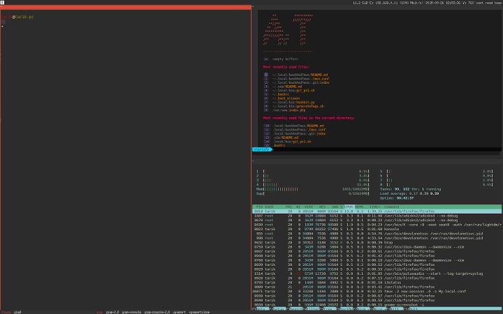

# Conf

Configuration files for some things

##Instal

Launch install.sh script,
It create symlinks in your home.

##Git

###Some aliases
* pretty log with lg
* ci for commit
* co for checkout
* st for status without untracked files
* dw & dws for diff --color-words unstaged files or not
* rh & rhh for reset head and reset head --hard
* gitdiff for git diff in a watch refreshing every 2 seconds
* gitst same but for status

###Other
Create a template commit message in your home.
This configuration need it.

##Bash

###Prompt

####Status git:
* ⚡ for tracked modified files
* ✓ for added to stage files
* ✗ for untracked files
* ⚑ for stash list
* ↗ for local are ahead from remote
* ↖ for local are behind from remote
* ⤧ local and remote have diverged

###Sourced
List of some sourced ressources, mainly for completion on mac OS(need brew), debian and centos.
* bash_completion
* git-prompt
* bash_completion_tmux

###Aliases
I'm not listing all but see some significants i think
* c for cd
* l for ls -lFh --group-directories-first
* g for grep -n --color=auto
* cp, mv & rm need confirm on overwrite
* vi for vim -u NONE, no plugins no vimrc

###Other

User root displayed on red background, maximum stress guaranty!

##Zsh

Coming soon…

##Tmux

* Prefix 'a'
* Shorten delay between tmux command
* Panes label are centered
* Panes start to index 1 instead 0
* In status bar you find
    * on the left
        * ip (ifconfig inet)
        * user and host
    * on the right
        * session tmux name
        * and time

###Aliases
* `<c-a>r` to refresh tmux conf
* `<c-a>m` to enable mouse mode
* `<c-a>M` to disable mouse mode (paste with middle mouse click will work)
* `tls` in bash, list session tmux
* `t` eq `tmux -u -2`
* `tt` eq `tmux -u -2 attach -d`

##I3

* Use 'super key' as prefix
* Status bar is on the top

###Aliases
* Launching konsole with `mod+return`
* Kill focused window `mod+Shift+q`
* You can change focus with same vim arrows (jkl)
* Fullscreen mode `mod+f`
* Reload i3 conf file `mod+Shift+c`
* …
